<div align="center">
  

  <h1>AuthForge</h1>

  <p>
    <strong>A hardened authentication starter for Next.js.</strong><br />
    Credentials, magic links, and OAuth2/OIDC with rate limiting, session caching, i18n,
    and security hardening.
  </p>
</div>

<br />

> **AuthForge** started as a way to understand authentication and what a login system has to survive: timing attacks,
> account enumeration, brute-force attempts, race conditions, and silent misconfiguration. What began as a small Next.js +
> Auth.js experiment grew, session by session, into a reference implementation with a full test suite, CI/CD, and security
> measures. This README documents what’s actually in the box.

<br />

<div align="center">
  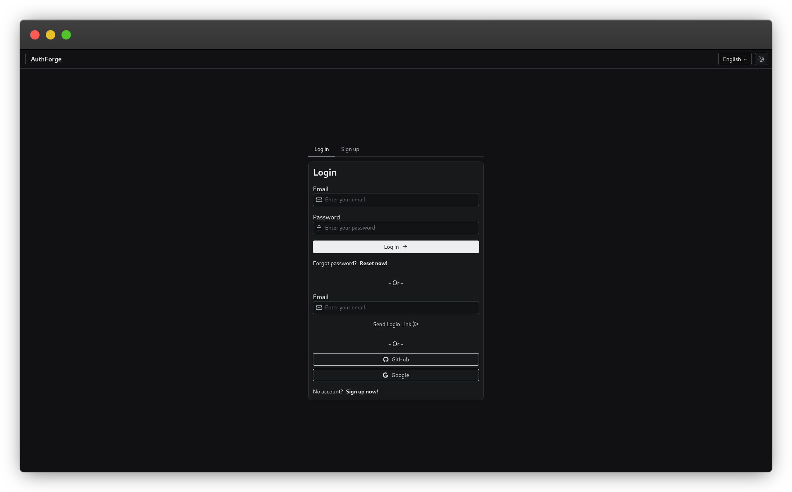
</div>

## Table of Contents

- [Features](#features)
- [Tech Stack](#tech-stack)
- [Screenshots](#screenshots)
- [Architecture](#architecture)
- [Getting Started](#getting-started)
  - [Prerequisites](#prerequisites)
  - [Quick Start with Docker](#quick-start-with-docker-recommended)
  - [Manual Setup](#manual-setup)
  - [Environment Variables](#environment-variables)
- [Docker](#docker)
- [Testing](#testing)
- [CI/CD](#cicd)
- [Security](#security)
- [Internationalization](#internationalization)
- [Project Structure](#project-structure)
- [Roadmap](#roadmap)
- [Contributing](#contributing)
- [License](#license)

<a id="features"></a>

## ✨ Features

### Authentication

- **Credentials sign-in**: Email + password, with timing-safe comparison against a dummy hash so a
  wrong password and a nonexistent account take the same amount of time to reject.
- **Passwordless magic-link sign-in**: One-click email login via Auth.js's email provider, with the
  same enumeration protections as credentials.
- **OAuth2/OIDC sign-in**: GitHub and Google, with configurable dangerous-account-linking per provider.
- **Signup**: With strict validation (name, email, password strength) and duplicate-email detection.
- **Forgot/reset password**: Single-use, time-limited, hashed tokens; resetting a password
  atomically updates the password, invalidates the token, and revokes every existing session for
  that user in one database transaction.
- **DB-backed sessions for every provider, including credentials**: A custom JWT `encode` override
  gives credentials sign-ins a real, revocable, database session instead of a self-contained JWT.

### Security

Timing-safe checks, rate limiting, timing side-channel mitigation, atomic writes, and fail-fast environment
validation are all first-class citizens here, not an afterthought.

See the [Security](#security) section below for the full breakdown.

### Internationalization

- **5 languages out of the box**: English, Arabic, Spanish, Russian, Chinese (including
  **RTL layout support** for Arabic).
- Locale persisted via cookie, resolved server-side so there's no flash of the wrong language.

### UI/UX

- **Dark / light theme**, persisted via cookie and resolved server-side.
- Built on [Radix Themes](https://www.radix-ui.com/themes) for accessible, consistent components.
- Every form field is fully validated with [Zod](https://zod.dev/) + React Hook Form.

### Developer Experience

- **248 tests across 17 suites** (Jest + React Testing Library) covering API routes, auth logic, and
  every UI component.
- **TypeScript everywhere**, strict mode, Zod-validated at every request boundary.
- **ESLint + Prettier**, enforced in CI.
- **GitHub Actions CI**: format check, lint, type check, full test suite, production build, and a
  dependency security audit, all on every pull request.
- **Automated releases** via [Release Please](https://github.com/googleapis/release-please):
  Conventional Commits in, changelog and versioned GitHub Releases out.
- **Dockerized** for both development (hot reload) and production (multi-stage, non-root, standalone
  Next.js output).

<a id="tech-stack"></a>

## 🛠️ Tech Stack

<table align="center">
  <tr>
    <td align="center" width="110">
      <br />
      <sub><b>Next.js 16</b></sub>
    </td>
    <td align="center" width="110">
      <br />
      <sub><b>React 18</b></sub>
    </td>
    <td align="center" width="110">
      <br />
      <sub><b>TypeScript</b></sub>
    </td>
    <td align="center" width="110">
      <br />
      <sub><b>Tailwind CSS</b></sub>
    </td>
    <td align="center" width="110">
      <br />
      <sub><b>Radix Themes</b></sub>
    </td>
    <td align="center" width="110">
      <br />
      <sub><b>Auth.js</b></sub>
    </td>
  </tr>
  <tr>
    <td align="center" width="110">
      <br />
      <sub><b>Prisma</b></sub>
    </td>
    <td align="center" width="110">
      <br />
      <sub><b>SQLite</b></sub>
    </td>
    <td align="center" width="110">
      <br />
      <sub><b>Redis</b></sub>
    </td>
    <td align="center" width="110">
      <br />
      <sub><b>Docker</b></sub>
    </td>
    <td align="center" width="110">
      <br />
      <sub><b>Jest</b></sub>
    </td>
    <td align="center" width="110">
      <br />
      <sub><b>React Testing Library</b></sub>
    </td>
  </tr>
</table>

Also in the mix: **Zod** (schema validation), **React Hook Form**, **TanStack Query**, **Axios**,
**Nodemailer** + **React Email**, **rate-limiter-flexible**, **ESLint** & **Prettier**,
**Husky** + **lint-staged**, and **Testing Library**.

<a id="screenshots"></a>

## 📸 Screenshots

<table align="center">
  <tr>
    <td width="50%">
      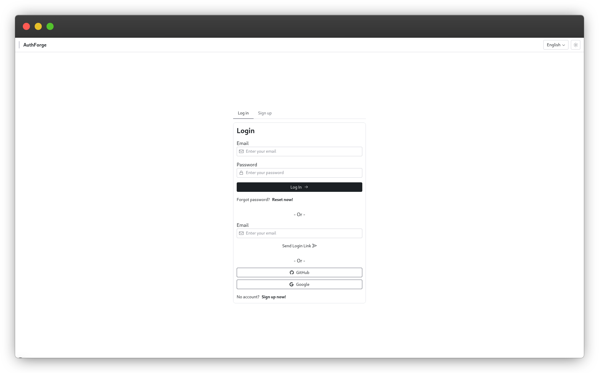
      <p align="center"><sub>Sign in (light mode)</sub></p>
    </td>
    <td width="50%">
      
      <p align="center"><sub>Sign in (dark mode)</sub></p>
    </td>
  </tr>
  <tr>
    <td width="50%">
      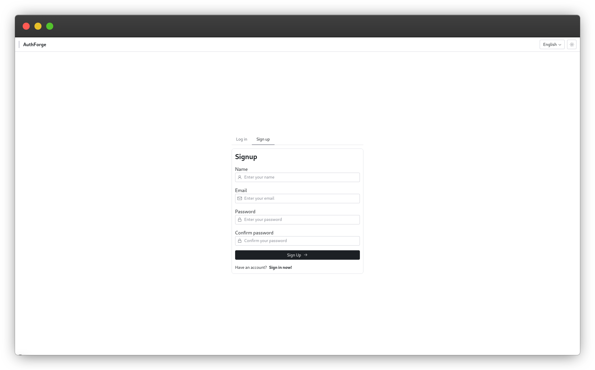
      <p align="center"><sub>Sign up (light mode)</sub></p>
    </td>
    <td width="50%">
      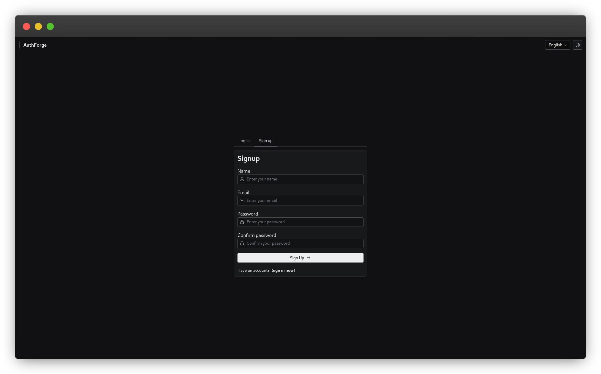
      <p align="center"><sub>Sign up (dark mode)</sub></p>
    </td>
  </tr>
  <tr>
    <td width="50%">
      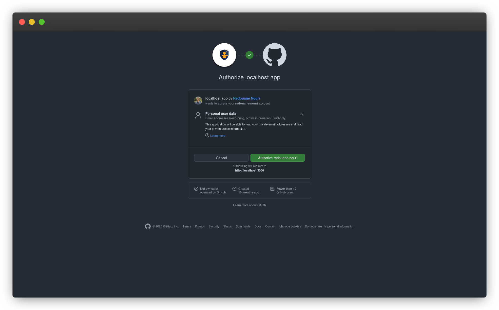
      <p align="center"><sub>OAuth (GitHub)</sub></p>
    </td>
    <td width="50%">
      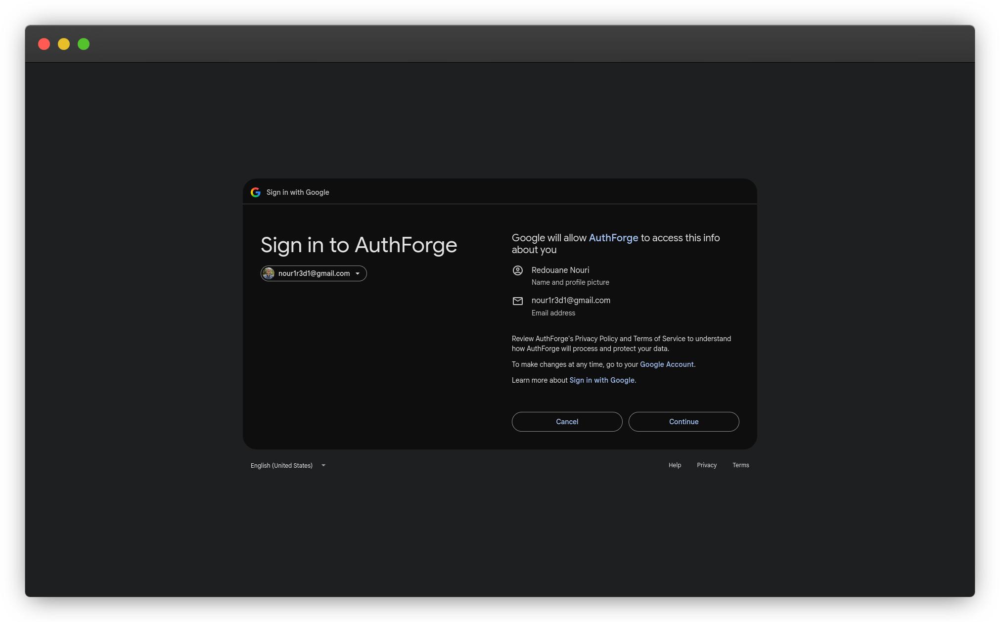
      <p align="center"><sub>OAuth (Google)</sub></p>
    </td>
  </tr>
  <tr>
    <td width="50%">
      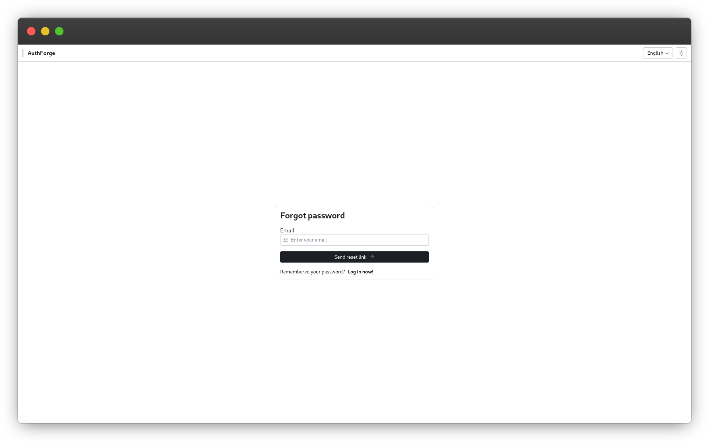
      <p align="center"><sub>Forgot password (light mode)</sub></p>
    </td>
    <td width="50%">
      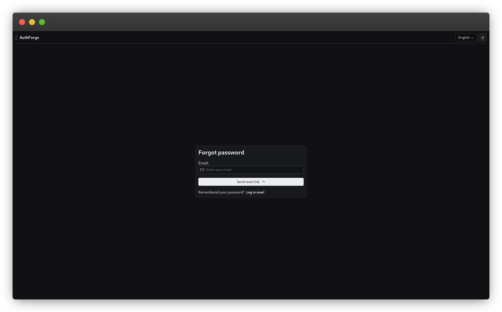
      <p align="center"><sub>Forgot password (dark mode)</sub></p>
    </td>
  </tr>
  <tr>
    <td width="50%">
      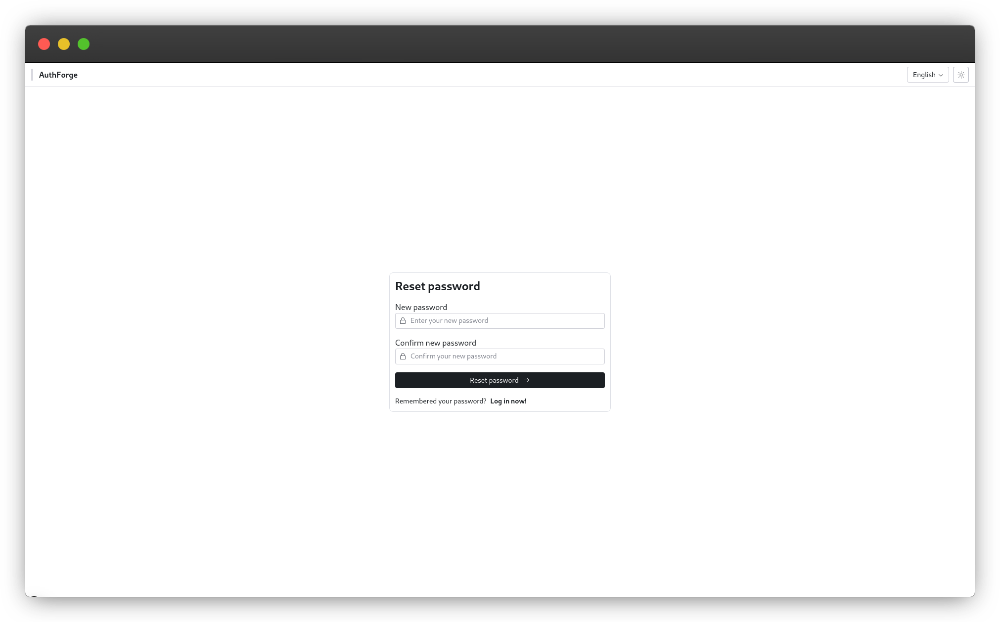
      <p align="center"><sub>Reset password (light mode)</sub></p>
    </td>
    <td width="50%">
      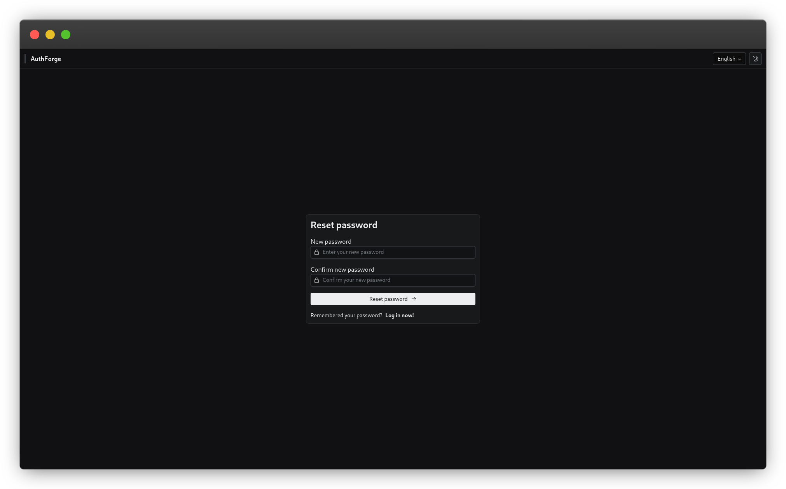
      <p align="center"><sub>Reset password (dark mode)</sub></p>
    </td>
  </tr>
  <tr>
    <td width="50%">
      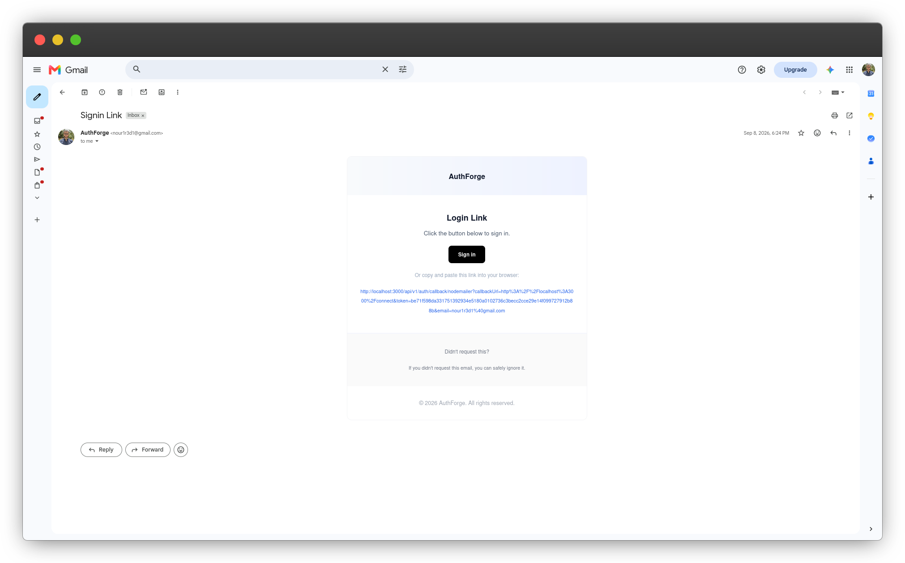
      <p align="center"><sub>Magic-link email</sub></p>
    </td>
    <td width="50%">
      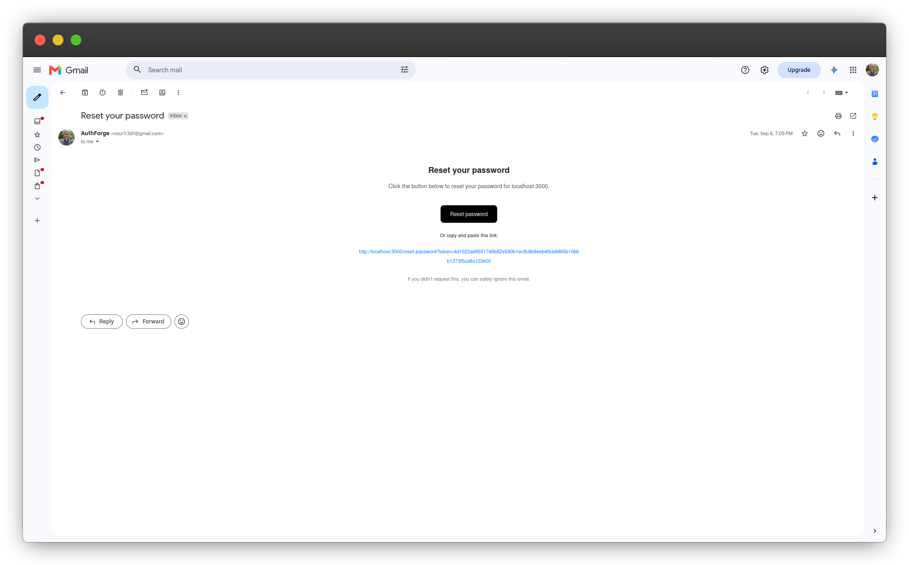
      <p align="center"><sub>Password-reset email</sub></p>
    </td>
  </tr>
  <tr>
    <td width="50%">
      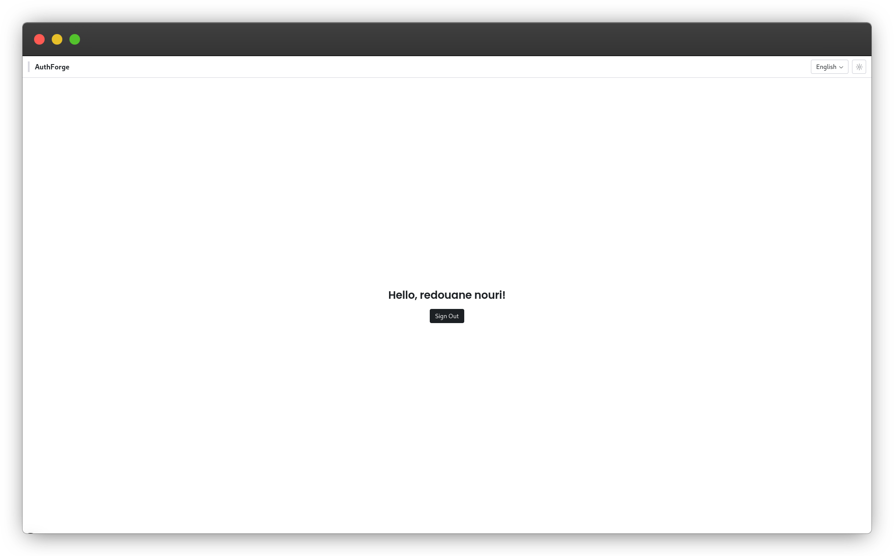
      <p align="center"><sub>Signed in (light mode)</sub></p>
    </td>
    <td width="50%">
      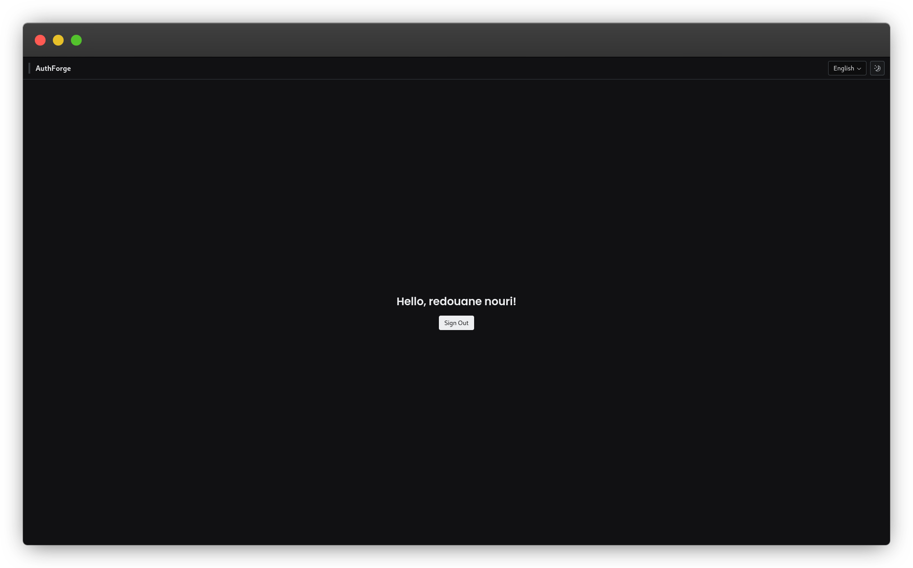
      <p align="center"><sub>Signed in (dark mode)</sub></p>
    </td>
  </tr>
</table>
<a id="architecture"></a>

## 🏗️ Architecture

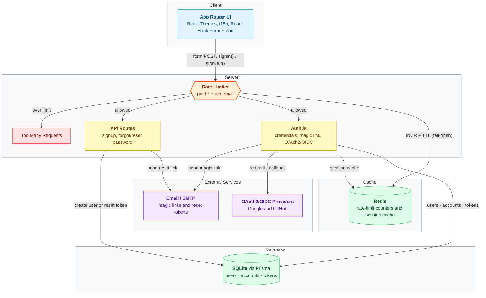

Every sensitive endpoint checks rate limits before touching the database, every password-changing
operation is wrapped in a transaction, and session reads are Redis-cached with automatic invalidation
on write, falling back to the database (and failing open on rate limiting) if Redis is unavailable.

<a id="getting-started"></a>

## 🚀 Getting Started

### Prerequisites

- Node.js `>= 20.9.0`
- A Node.js package manager (npm, Yarn, pnpm, Bun, ...)
- [Docker](https://www.docker.com/) (recommended) **or** a local Redis instance if running manually
- An SMTP relay with OAuth2 (e.g. Gmail) for magic-link and password-reset emails
- OAuth app credentials from [GitHub](https://github.com/settings/developers) and/or
  [Google Cloud Console](https://console.cloud.google.com/)

### Quick Start with Docker (recommended)

```bash
git clone https://github.com/redouane-nouri/AuthForge.git
cd AuthForge
cp .env.example .env
# fill in .env (see Environment Variables below)

docker compose -f docker-compose.dev.yml up --build
```

This builds the app, starts a Redis container alongside it, runs pending Prisma migrations
automatically, and serves the app at **http://localhost:3000** (configurable via NEXT_PUBLIC_URL env var) with hot
reload.

### Manual Setup

_Commands below use `npm`; swap in `yarn`, `pnpm`, or `bun` as you prefer._

```bash
git clone https://github.com/redouane-nouri/AuthForge.git
cd AuthForge
npm install
cp .env.example .env
# fill in .env (see Environment Variables below)

npx prisma generate
npx prisma migrate dev

npm run dev
```

### Environment Variables

All variables live in `.env` (see `.env.example` for a ready-to-copy template).

| Variable                                                            | Description                                                            |
| ------------------------------------------------------------------- | ---------------------------------------------------------------------- |
| `NEXT_PUBLIC_URL`                                                   | Public base URL of the app (e.g. `http://localhost:3000`)              |
| `NEXT_PUBLIC_AXIOS_BASEPATH`                                        | Base path the client-side API calls are made against (`/api/v1`)       |
| `NEXT_TELEMETRY_DISABLED`                                           | Set to `1` to opt out of Next.js's anonymous usage telemetry           |
| `DB_URL`                                                            | Prisma/SQLite connection string                                        |
| `REDIS_URL`                                                         | Redis connection string (rate limiting + session cache)                |
| `BCRYPT_HASH_ROUNDS`                                                | bcrypt cost factor (integer, 4-31)                                     |
| `AUTH_SECRET`                                                       | Auth.js signing secret (generate one with `openssl rand -base64 33`)   |
| `AUTH_BASEPATH`                                                     | Base path for Auth.js's own endpoints (`/api/v1/auth`)                 |
| `AUTH_TRUST_HOST`                                                   | Trust the request's `Host` header (needed behind most reverse proxies) |
| `AUTH_URL`                                                          | Canonical Auth.js callback URL                                         |
| `AUTH_GITHUB_ID` / `AUTH_GITHUB_SECRET`                             | GitHub OAuth app credentials                                           |
| `AUTH_ALLOW_GITHUB_DANGEROUS_EMAIL_ACCOUNT_LINKING`                 | Allow linking a GitHub sign-in to an existing account by email         |
| `AUTH_GOOGLE_ID` / `AUTH_GOOGLE_SECRET`                             | Google OAuth app credentials                                           |
| `AUTH_ALLOW_GOOGLE_DANGEROUS_EMAIL_ACCOUNT_LINKING`                 | Allow linking a Google sign-in to an existing account by email         |
| `EMAIL_SERVER_HOST` / `EMAIL_SERVER_PORT` / `EMAIL_SERVER_SECURE`   | SMTP server connection details                                         |
| `EMAIL_SERVER_AUTH_USER`                                            | Mailbox address used to send email                                     |
| `EMAIL_SERVER_AUTH_CLIENT_ID` / `_CLIENT_SECRET` / `_REFRESH_TOKEN` | OAuth2 credentials for the mailbox                                     |
| `EMAIL_FROM`                                                        | "From" header on outgoing emails                                       |

Every one of these is validated on startup, an unset or malformed value fails immediately with a
clear error naming the exact variable, instead of surfacing as a cryptic failure deep in some
unrelated code path later.

<a id="docker"></a>

## 🐳 Docker

Two Compose files, two targets of the same multi-stage `Dockerfile`:

```bash
# Development: hot reload, bundled Redis, source mounted as a volume
docker compose -f docker-compose.dev.yml up --build

# Production: standalone Next.js build, non-root user, persistent SQLite + Redis volumes
docker compose -f docker-compose.prod.yml up --build -d
```

In both cases, `docker-entrypoint.sh` runs `prisma migrate deploy` before starting the server, so the
database schema is always up to date on container start.

<a id="testing"></a>

## 🧪 Testing

```bash
npm run test # run the full suite once (or yarn/pnpm/bun test)
npm run test:watch # watch mode
```

248 tests across 17 suites, covering every API route, the Auth.js configuration itself, and every UI
component.

<a id="cicd"></a>

## 🔄 CI/CD

- **[`ci.yml`](.github/workflows/ci.yml)**: on every pull request into `main`, dependency audit,
  format check, lint, type check, the full test suite, and a production build. Nothing merges without
  all of that passing.
- **[`release-please.yml`](.github/workflows/release-please.yml)**: on every merge into `main`,
  [Release Please](https://github.com/googleapis/release-please) reads Conventional Commits and
  maintains a standing "release PR" with the changelog and version bump.

<a id="security"></a>

## 🔒 Security

- **Content-Security-Policy + security headers** on every response: `X-Frame-Options`,
  `X-Content-Type-Options`, `Referrer-Policy`, and HSTS, configured in `next.config.ts`.
- **Timing-safe credential checks**: A login attempt for a nonexistent user still runs a full
  `bcrypt.compare()` against a precomputed dummy hash, so response time can't be used to determine
  whether an email is registered.
- **Deferred processing to close timing side-channels**: The magic-link and forgot-password flows
  defer the actual user lookup and email send until _after_ the HTTP response is already sent (via
  Next's `after()`), so the response latency itself never reveals whether an account exists.
- **Rate limiting on every sensitive endpoint**: Signup, credentials sign-in, magic-link sign-in, and
  forgot/reset password are all limited **per IP and per email** independently, backed by Redis, and
  designed to **fail open** (a Redis outage degrades to "no rate limiting," not "the app is down").
- **Atomic password resets**: Resetting a password runs inside a single database transaction for
  password update, verification-token deletion, and revocation of every existing session for that
  user all commit together or not at all, with the Redis session cache invalidated afterward.
- **Strict, typed request validation**: Every API route parses its body through a Zod schema in
  `.strict()` mode, rejecting unexpected fields outright.
- **Fail-fast environment validation**: every required environment variable is read through a
  dedicated, validated getter (`getXFromEnv()`) that throws a precise error at startup if it's
  missing or malformed, rather than letting it silently become `NaN`/`undefined` and fail mysteriously
  later, often in production, often far from the actual cause.

<a id="internationalization"></a>

## 🌍 Internationalization

Powered by [next-intl](https://next-intl.dev/), with the locale resolved server-side from a cookie
(no flash of the wrong language) and persisted client-side on change. `en` is the default locale,
and `ar` renders a full RTL layout.

| Language | Code |
| -------- | ---- |
| English  | `en` |
| Arabic   | `ar` |
| Spanish  | `es` |
| Russian  | `ru` |
| Chinese  | `zh` |

<a id="project-structure"></a>

## 📁 Project Structure

```
.
├── app/ # Next.js App Router
│ ├── api/v1/auth/ # Signup, forgot/reset password, and the Auth.js catch-all route
│ ├── connect/ # Combined sign in / sign up page
│ ├── forgot-password/
│ └── reset-password/
├── components/ # UI, grouped by feature (auth, signin, signup, forgotPassword, resetPassword, connect, layout, home)
├── lib/
│ ├── auth/ # Auth.js configuration and helpers
│ ├── axios/ # Shared Axios client instance
│ ├── prisma/ # Prisma client singleton
│ ├── redis/ # Redis client singleton + session cache
│ ├── rateLimiter/ # Per-IP / per-email rate limiters
│ ├── mailer/ # Shared nodemailer transporter
│ └── i18n/ # next-intl request config
├── messages/ # Translation files (en, ar, es, ru, zh)
├── prisma/ # Schema + migrations (SQLite)
├── utils/ # Shared functions, constants, enums, types
└── .github/workflows/ # CI and automated releases
```

<a id="roadmap"></a>

## 🗺️ Roadmap

- [ ] Passkey/WebAuthn support
- [ ] Two-factor authentication (TOTP)
- [ ] Postgres support alongside SQLite

<a id="contributing"></a>

## 🤝 Contributing

Issues and pull requests are welcome. Commit messages follow
[Conventional Commits](https://www.conventionalcommits.org/) (`feat:`, `fix:`, `test:`, `refactor:`,
...). This is what drives the automated changelog and versioning, so it's not just a style
preference.

Git hooks (via [Husky](https://typicode.github.io/husky/)) enforce the same checks CI runs, so
issues get caught locally instead of after a push:

- **pre-commit**: runs [lint-staged](https://github.com/lint-staged/lint-staged), which formats and
  lints only the files you've staged.
- **pre-push**: runs the full `format:check && lint && tsc --noEmit && test` sequence once, right
  before the push goes out.

Both are installed automatically the first time you install dependencies (via the `prepare`
script, which npm, Yarn, pnpm, and Bun all run).

<a id="license"></a>

## 📄 License

Distributed under the [MIT License](./LICENSE).
